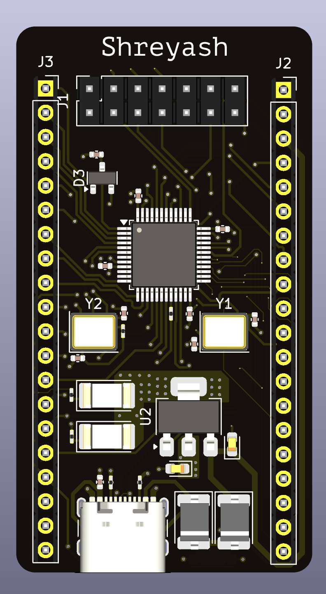
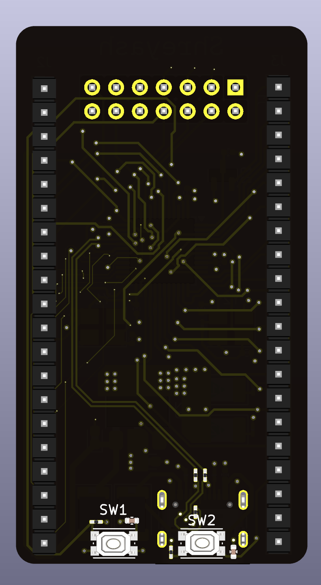
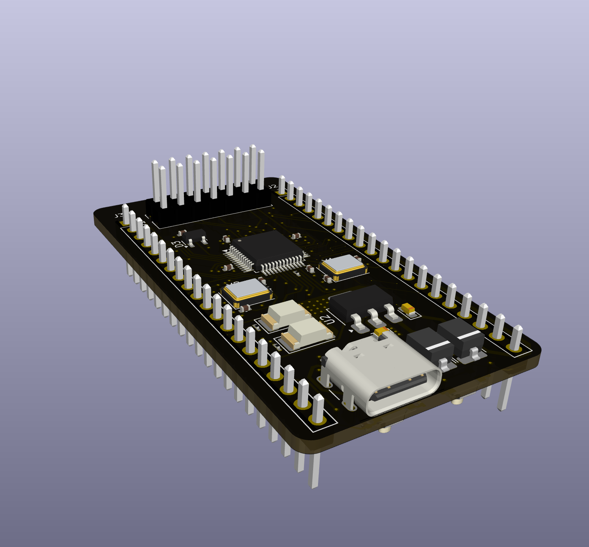

# ⚡ STM-OWN – Custom STM32 Development Board

Custom STM32-based development board designed in **KiCad** for learning and experimenting with embedded systems and PCB design.

This project demonstrates the complete PCB design workflow including schematic design, PCB layout, custom footprint creation, and hardware documentation.

---

## 🧠 Project Overview

**STM-OWN** is a custom STM32 development board inspired by common development boards such as Bluepill and Nucleo boards.

The objective of this project was to practice:

- STM32 hardware design
- Schematic capture
- PCB layout and routing
- Creating custom KiCad libraries
- Generating manufacturing-ready files
- Hardware documentation

This board can be used for:

- Embedded firmware development
- Peripheral interfacing
- Learning STM32 architecture
- Rapid prototyping

---

## 🛠 Tools Used

- **KiCad** – Schematic capture and PCB design
- **Custom symbol libraries**
- **Custom footprint libraries**
- **Git & GitHub** – Version control
- **PDF exports** – Documentation

---

## 🏗 PCB Design

Features of the board include:

- STM32 microcontroller core
- GPIO breakout headers
- Power regulation circuitry
- Programming/debug interface
- User interface components (buttons / LEDs)

Design considerations:

- Proper decoupling capacitors
- Clean power routing
- Ground plane usage
- Optimized component placement
- Design Rule Check (DRC) compliance

---

## 🖼 Board Preview

### Front View

### Back View

### 3D View

---

## 📂 Repository Structure
STM-OWN
│
├── Main/ # KiCad project files
│ ├── Main.kicad_pcb
│ ├── Main.kicad_pro
│ └── backups/
│
├── SIGN.pretty/ # Custom footprint library
│
├── FRONT.png # PCB front render
├── BACK.png # PCB back render
├── ANGLE-1.png # 3D board view
├── ANGLE-2.png # 3D board view
│
├── Schematic.pdf # Full schematic
├── Layout.pdf # PCB layout documentation
├── Basic.pdf # Design notes
│
└── README.md

---

## 📑 Documentation

Included design documentation:

- **Schematic.pdf** – Full circuit schematic
- **Layout.pdf** – PCB layout visualization
- **Basic.pdf** – Additional design notes

These files allow quick viewing of the design without opening KiCad.

---

## 🎯 Learning Outcomes

Through this project:

- Designed a complete STM32 hardware platform
- Learned PCB routing and layout techniques
- Created custom KiCad footprints and symbols
- Generated fabrication-ready design files
- Practiced professional hardware documentation

---

## 🚀 Future Improvements

Possible upgrades for the next revision:

- Add USB programming interface
- Add SWD debugging header
- Improve power regulation efficiency
- Add additional peripheral connectors
- Convert to a 4-layer PCB design

---

## 📜 License

This project is open hardware and available for educational and experimental use.

